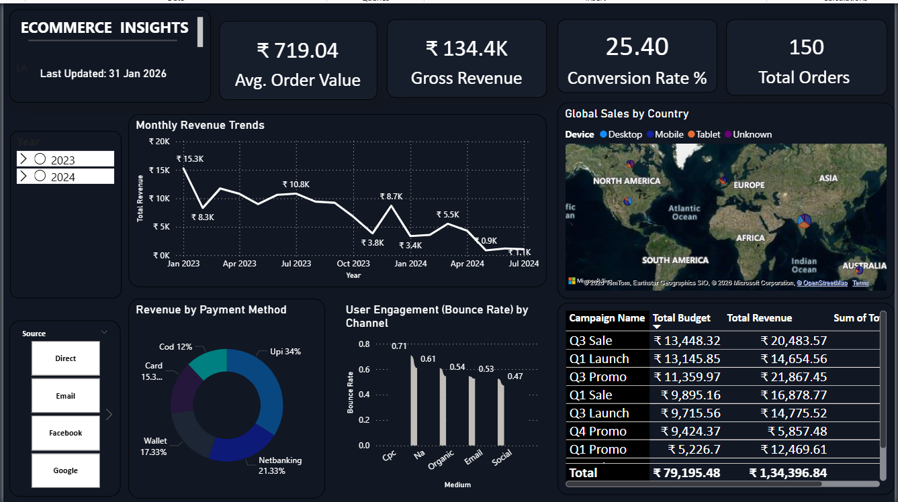

# 📊 E-Commerce Sales & Customer Engagement Analysis
**Focus:** Revenue Optimization, Customer Retention & Stakeholder Reporting

## 📌 Business Problem
The executive team lacked a centralized view of sales performance across different regions and product categories. Without real-time insights, the marketing team couldn't identify high-churn customer segments or the most profitable product sub-categories, leading to inefficient budget allocation.

## 🛠️ Tech Stack & Skills
* **Tool:** Power BI Desktop
* **Language:** DAX (Data Analysis Expressions) for complex measures
* **Data Source:** Multi-table E-commerce dataset
* **Key Skills:** Data Modeling (Star Schema), ETL (Power Query), Dashboard Design (UI/UX), Trend Analysis.

## 🚀 Key Insights & Business Impact
Through this analysis, I uncovered three critical business drivers:

1.  **High-Value Retention:** Identified that 20% of the customer base contributes to 60% of total revenue; I recommended a targeted loyalty program for this segment.
2.  **Product Seasonality:** Found a significant 15% dip in sales during [Insert Month] in the [Insert Region]. This allows the inventory team to adjust stock levels in advance.
3.  **Shipping Efficiency:** Discovered that orders with "Standard Class" shipping had a 5% higher return rate compared to "First Class," suggesting a potential quality control issue in standard transit.

## 🔍 Analytical Questions Answered
* What is the **Year-over-Year (YoY)** growth in profit margins?
* Which **Product Categories** are underperforming relative to their inventory costs?
* What is the **Customer Acquisition Cost (CAC)** trend over the last 4 quarters?
* Which geographical regions show the highest **Revenue per Customer**?

## 📊 The Dashboard (Visualizations)

**Key Features Includes:**
* **Dynamic Filters:** Users can slice data by Region, Segment, and Time Period.
* **KPI Cards:** Real-time tracking of Total Sales, Profit, and Quantity.
* **Customer Breakdown:** Top 10 customers by sales volume.
